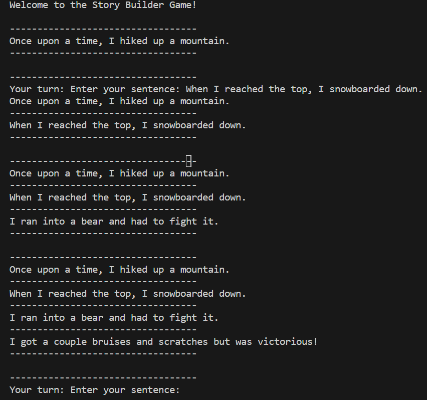

# Story Builder Game

## Introduction
This project is a multithreaded story builder game that allows multiple people to take turns contributing to a shared story.

Each player takes turns contributing to the story. Once the last player takes a turn, then the turn goes back to the first player to join the server. Only one player at a time can take a turn. 

This project uses the capabilities of synchronized blocks and semaphores to ensure that only one player at a time can contribute to the story. After each turn, the updated story is sent to each player. 

Once one player disconnects from the server, the game is over.

## Installation

1. Clone this repository to your local machine
2. Compile the StoryServer.java and StoryClient.java file
3. Run the StoryServer file first, then run the StoryClient file for each player
4. If you wish to test the server capabilities, compile the StoryServerTest.java and ClientManager.java files. After you have compiled them, run the StoryServerTest file first then run the ClientManager.

